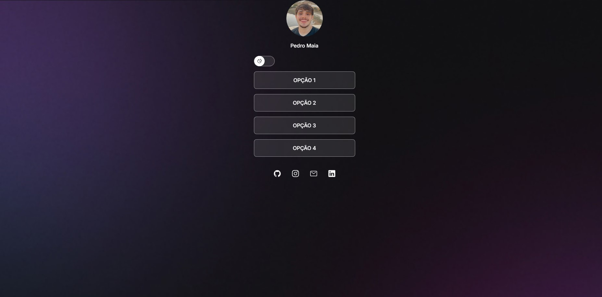

<h1 align="center"> Projeto Rockeat </h1>

Programa de um site sobre informações pessoais.  

  

 

  

## 🚀 Tecnologias

Esse projeto foi desenvolvido com as seguintes tecnologias:

- HTML e CSS
- JavaScript
- Git e Github
- Figma

## :memo: Licença

Esse projeto está sob a licença MIT.

---

